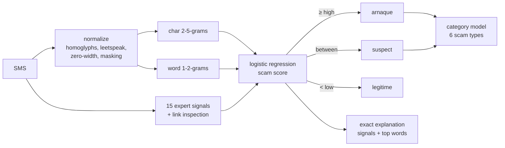

# sikaguard 🛡️

**Explainable detection of French-language SMS and Mobile Money scams in West Africa.**

[](https://github.com/asaphfelix03-beep/sikaguard/actions/workflows/ci.yml)
[](LICENSE)

-orange.svg)

*[Lire en français](README.fr.md)*

`sikaguard` (*sika* means *money* in Akan and Ewe) tells whether an SMS is a scam,
**what kind** of scam, and **why**: fake "sent by mistake" transfers, fake customer
service asking for a PIN, fake prizes, phishing links, too-good-to-be-true
investments and job offers.

```python
>>> from sikaguard import analyze
>>> r = analyze("Cher client Orange Money, votre compte sera bloqué. Envoyez votre code secret au 0701020304")
>>> r.verdict, r.category
('arnaque', 'usurpation_operateur')
>>> for reason in r.reasons: print("-", reason.message)
- Le message demande un code secret (PIN, OTP, mot de passe). Aucun opérateur ni aucune banque ne le demande jamais.
- Le message menace de bloquer ou de suspendre votre compte ou votre numéro.
- Formulation proche d'arnaques connues : « client », « compte », « code secret ».
```

> **Status: alpha.** The bundled model `0.1.0.dev1` is trained on 602 SMS: a hand-written
> seed set, **real legitimate SMS** (88milSMS research corpus) and reconstructions of
> **12 real, dated scam campaigns** documented in Côte d'Ivoire and Senegal (PLCC,
> police, operators, press). It has not yet seen real collected scam SMS, so it is flagged
> *not for production*; collecting them is the next milestone ([roadmap](ROADMAP.md)).
> Do not use it to block messages automatically.

## Why

Mobile Money is how millions of people in West Africa send and receive money, and
SMS scams follow it: "I sent you 25 000 F by mistake, send it back", "your account
will be blocked, give us your PIN", "you won the tombola, pay the fees". Almost every
public SMS-spam dataset is in English, so the existing filters do not cover French
written the way it is in Abidjan, Dakar or Ouagadougou.

sikaguard's contribution is twofold:

1. **An open, documented dataset** of French-language West-African scam SMS with a
   scam taxonomy, an annotation guide and a datasheet ([`data/`](data/), [`docs/`](docs/)).
2. **A small, explainable and evasion-resistant detector** that any developer can
   embed (`pip`), call (REST API) or try ([demo](demo/)).

## Features

- **Three verdicts:** `arnaque` / `suspect` / `legitime`, with decision thresholds you
  can tune (precision ≥ 95 % for `arnaque`, recall ≥ 98 % for "at least suspect", chosen
  on cross-validation).
- **Scam type:** six categories, with practical advice for each.
- **Exact explanations:** 19 red-flag rules ("asks for a secret code", "creates urgency",
  "suspicious link", "asks to install an APK", "claims a new number", "asks for secrecy"…)
  plus the words that weighed most in the linear model.
- **Anti-evasion normalization:** leetspeak (`0range M0ney`), Cyrillic look-alike letters,
  spaced letters (`c o d e`), zero-width characters, emojis inside words, and links
  written with look-alike letters (homograph attacks).
- **Privacy by design:** phone numbers, codes, references and e-mails are masked before
  the model sees them; the API never logs SMS text.
- **Secure model loading:** `skops` (no `pickle`), SHA-256 checked against a manifest,
  explicit allow-list of types.
- **Light and fast:** ~1 MB model, scikit-learn only, no GPU; 4.8 ms median and 9 ms
  p95 per SMS on a laptop CPU, 1.6 ms per SMS in batches.

## Install

```bash
pip install sikaguard            # library + CLI
pip install "sikaguard[api]"     # + REST API
```

Until the first PyPI release: `pip install git+https://github.com/asaphfelix03-beep/sikaguard`.

## Use

**Python**

```python
from sikaguard import Analyzer

analyzer = Analyzer(threshold_high=0.9, threshold_low=0.3)  # stricter "arnaque" verdict
results = analyzer.analyze_batch(["SMS 1", "SMS 2"])
print(results[0].to_dict())
```

**Command line**

```bash
sikaguard "Félicitations! Vous avez gagné 1 000 000 F. Payez 5000 F de frais pour recevoir."
sikaguard --json -f messages.txt       # one SMS per line, JSON lines output
```

**REST API**

```bash
uvicorn sikaguard.api:app --port 8000          # or: docker run -p 8000:8000 sikaguard-api
curl -s localhost:8000/v1/analyze -H "content-type: application/json" \
     -d '{"text": "Je t'\''ai envoyé 20000 par erreur, renvoie stp"}'
```

| Route | Purpose |
|---|---|
| `POST /v1/analyze` | one SMS (1 to 1 000 characters) |
| `POST /v1/analyze/batch` | up to 100 SMS |
| `GET /v1/info` | model and dataset versions, thresholds |
| `GET /health` | liveness probe |

Interactive documentation at `/docs`. Build the image with `docker build -t sikaguard-api .`
(Python 3.12 slim, non-root user, health check).

**Demo**: `pip install -e ".[demo]" && python demo/app.py` (also deployable as a Hugging Face Space).


## How it works



The same `pii` and `normalize` code is used to build the dataset and at inference, so
the model sees identical placeholders (`<tel>`, `<code>`, `<url>`…) in both.

## Evaluation

Full report: [`reports/evaluation.md`](reports/evaluation.md) · previous version:
[`reports/history/0.1.0.dev0/`](reports/history/0.1.0.dev0/evaluation.md).

**Protocol.** 602 SMS. Split 80/20 **by group**: near-duplicates (character 5-gram
Jaccard ≥ 0.8) and all rows of a documented campaign share a group, so a test campaign
is never seen in training. Model selection and thresholds by grouped 5-fold
cross-validation on train only; test split opened **once**; 95 % bootstrap
confidence intervals. A test split whose errors have been read is *consumed*: the
`0.1.0.dev0` test rows were archived and forced into train before drawing a new one.

### The measurement that matters most: real SMS

**1 000 authentic French SMS** from the 88milSMS research corpus, never used for
training. All of them are legitimate, so every alert is a false alarm:

| | Rate [95 % CI] |
|---|---|
| Flagged `arnaque` | **0.6 %** [0.2 %, 1.1 %] |
| Flagged `arnaque` or `suspect` | 1.3 % [0.6 %, 2.0 %] |

### Test split (104 SMS)

| Model | Test average precision [95 % CI] | Recall @ precision 95 % |
|---|---|---|
| Majority class | 0.346 [0.250, 0.442] | 0 % |
| Rules only | 0.959 [0.902, 1.000] | 56 % |
| Naive Bayes (words) | 0.996 [0.986, 1.000] | 94 % |
| Linear SVM | 0.997 [0.988, 1.000] | 97 % |
| **sikaguard** | **0.997 [0.988, 1.000]** | **97 %** |

Pre-registered objectives (targets fixed before seeing the results):

| Objective | Target | 0.1.0.dev0 | **0.1.0.dev1** |
|---|---|---|---|
| Average precision | ≥ 0.95 | 0.973 ✅ | **0.997** ✅ |
| Recall at 95 % precision | ≥ 90 % | 80.6 % ❌ | **97.2 %** ✅ |
| False positives on hard legitimate SMS (notifications, OTP) | ≤ 5 % | 13.6 % ❌ | **0 %** ✅ |
| Detection under the worst of 7 disguises | ≥ 85 % | 91.7 % ✅ | **100 %** ✅ |
| False positives on 1 000 real SMS *(added for dev1)* | ≤ 5 % | — | **0.6 %** ✅ |

**Reading these numbers honestly**

- The test split is close to saturation (AP 0.997): the scams in it are hand-written or
  reconstructed, and real scams will be harder. The real-SMS benchmark is the least
  biased number here; real collected scams are the next milestone.
- The author of the dev1 data and signal fixes had read the dev0 errors, so the dev1
  test numbers may be slightly optimistic. This is why the dev0 test was consumed and
  why the report carries a note.
- Linear SVM and sikaguard tie on this split; sikaguard's model was chosen *before*
  the evaluation for its exact explanations and its robustness.
- The scam *type* is the weak point: 75 % accuracy on test scams (macro-F1 0.74), down
  from 89 %, because test campaigns are new to the model.
- Robustness: every one of the 7 disguises leaves detection at 100 %; without the
  normalization module, look-alike letters drop it to 89 %.

## Data

| File | Content |
|---|---|
| [`data/seed/seed_sms.csv`](data/seed/seed_sms.csv) | 407 hand-written seed SMS (177 scams, 230 legitimate) |
| [`data/sources/88milsms_sample.csv`](data/sources/) | 150 **real** legitimate SMS (88milSMS, CC BY 4.0) |
| [`data/sources/ci_campagnes_documentees.csv`](data/sources/) | 40 reconstructions of 12 real, dated scam campaigns (Côte d'Ivoire, Senegal) + 5 official notices, with source URLs |
| [`data/eval/88milsms_eval.csv`](data/eval/) | 1 000 real SMS kept out of training (external benchmark) |
| [`data/history/`](data/history/) | consumed test splits |
| [`data/processed/`](data/processed/) | validated, de-duplicated, grouped and split dataset + statistics |
| [`docs/annotation_guide.md`](docs/annotation_guide.md) | taxonomy, inclusion rules, anonymization (in French) |
| [`docs/datasheet.md`](docs/datasheet.md) · [`docs/model_card.md`](docs/model_card.md) | datasheet and model card |

Rebuild everything (the 88milSMS archive is downloaded once from Ortolang, see
[`data/sources/README.md`](data/sources/README.md)):

```bash
python -m sikaguard_lab.import_88milsms                                  # real SMS samples
python -m sikaguard_lab.build --consumed data/history/test_0.1.0.dev0.csv
python -m sikaguard_lab.train                                            # grouped CV, thresholds
python -m sikaguard_lab.evaluate                                         # benchmark, CIs, robustness
```

## Contributing

The most valuable contribution is **data**: if you received a scam SMS,
[report it](https://github.com/asaphfelix03-beep/sikaguard/issues/new?template=nouvelle-arnaque.yml)
(anonymized: no phone numbers or names). See [CONTRIBUTING.md](CONTRIBUTING.md) for code
contributions and [SECURITY.md](SECURITY.md) for vulnerabilities.

## Citation

If you use the dataset or the model, please cite it ([CITATION.cff](CITATION.cff)):

```
Ojewumi, A. F. (2026). sikaguard: explainable detection of French-language SMS and
Mobile Money scams (version 0.1.0.dev1) [Computer software].
https://github.com/asaphfelix03-beep/sikaguard
```

## License and disclaimer

Code under the [MIT license](LICENSE). sikaguard is an independent project, **not
affiliated** with Orange, MTN, Moov, Wave or any bank; operator names are used only to
describe the scams that impersonate them. The tool helps people decide; it does not
replace the official channels of your operator or bank.
