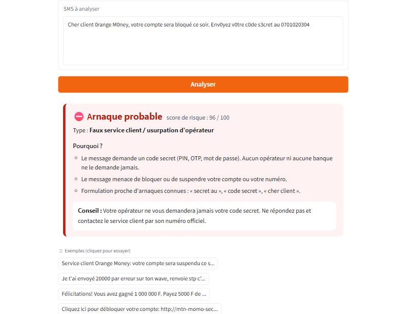
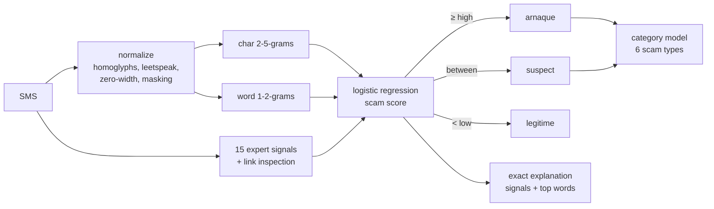

# sikaguard 🛡️

**Explainable detection of French-language SMS and Mobile Money scams in West Africa.**

[](https://github.com/asaphfelix03-beep/sikaguard/actions/workflows/ci.yml)
[](LICENSE)

-orange.svg)

*[Lire en français](README.fr.md)*

`sikaguard` (*sika* means *money* in Akan and Ewe) tells whether an SMS is a scam,
**what kind** of scam, and **why**: fake "sent by mistake" transfers, fake customer
service asking for a PIN, fake prizes, phishing links, too-good-to-be-true
investments and job offers.

```python
>>> from sikaguard import analyze
>>> r = analyze("Cher client Orange Money, votre compte sera bloqué. Envoyez votre code secret au 0701020304")
>>> r.verdict, r.category
('arnaque', 'usurpation_operateur')
>>> for reason in r.reasons: print("-", reason.message)
- Le message demande un code secret (PIN, OTP, mot de passe). Aucun opérateur ni aucune banque ne le demande jamais.
- Le message menace de bloquer ou de suspendre votre compte ou votre numéro.
- Formulation proche d'arnaques connues : « client », « compte », « sera bloque ».
```

> **Status: alpha.** The bundled model `0.1.0.dev2` is trained on 2 063 SMS, **1 611 of
> them real**: 811 real scam SMS reported by victims (IMC'25 research dataset, reviewed by
> hand) and 800 real personal SMS (88milSMS corpus), plus a hand-written West-African seed
> set and reconstructions of 12 documented Ivorian and Senegalese campaigns. On real SMS it
> never saw, it catches **99.4 %** of scams with **0.9 %** false alarms. The real scams come
> from France, Belgium and Canada: until real West-African scam SMS are collected, the
> model stays flagged *not for production* ([roadmap](ROADMAP.md)).

## Why

Mobile Money is how millions of people in West Africa send and receive money, and
SMS scams follow it: "I sent you 25 000 F by mistake, send it back", "your account
will be blocked, give us your PIN", "you won the tombola, pay the fees". Almost every
public SMS-spam dataset is in English, so the existing filters do not cover French
written the way it is in Abidjan, Dakar or Ouagadougou.

sikaguard's contribution is twofold:

1. **An open, documented dataset** of French-language West-African scam SMS with a
   scam taxonomy, an annotation guide and a datasheet ([`data/`](data/), [`docs/`](docs/)).
2. **A small, explainable and evasion-resistant detector** that any developer can
   embed (`pip`), call (REST API) or try ([demo](demo/)).

## Features

- **Three verdicts:** `arnaque` / `suspect` / `legitime`, with decision thresholds you
  can tune (precision ≥ 95 % for `arnaque`, recall ≥ 98 % for "at least suspect", chosen
  on cross-validation).
- **Scam type:** six categories, with practical advice for each.
- **Exact explanations:** 19 red-flag rules ("asks for a secret code", "creates urgency",
  "suspicious link", "asks to install an APK", "claims a new number", "asks for secrecy"…)
  plus the words that weighed most in the linear model.
- **Anti-evasion normalization:** leetspeak (`0range M0ney`), Cyrillic look-alike letters,
  spaced letters (`c o d e`), zero-width characters, emojis inside words, and links
  written with look-alike letters (homograph attacks).
- **Privacy by design:** phone numbers, codes, references and e-mails are masked before
  the model sees them; the API never logs SMS text.
- **Secure model loading:** `skops` (no `pickle`), SHA-256 checked against a manifest,
  explicit allow-list of types.
- **Light and fast:** ~2 MB model, scikit-learn only, no GPU; 1.8 ms median and 3.1 ms
  p95 per SMS on a laptop CPU, 0.6 ms per SMS in batches.

## Install

```bash
pip install sikaguard            # library + CLI
pip install "sikaguard[api]"     # + REST API
```

Until the first PyPI release: `pip install git+https://github.com/asaphfelix03-beep/sikaguard`.

## Use

**Python**

```python
from sikaguard import Analyzer

analyzer = Analyzer(threshold_high=0.9, threshold_low=0.3)  # stricter "arnaque" verdict
results = analyzer.analyze_batch(["SMS 1", "SMS 2"])
print(results[0].to_dict())
```

**Command line**

```bash
sikaguard "Félicitations! Vous avez gagné 1 000 000 F. Payez 5000 F de frais pour recevoir."
sikaguard --json -f messages.txt       # one SMS per line, JSON lines output
```

**REST API**

```bash
uvicorn sikaguard.api:app --port 8000          # or: docker run -p 8000:8000 sikaguard-api
curl -s localhost:8000/v1/analyze -H "content-type: application/json" \
     -d '{"text": "Je t'\''ai envoyé 20000 par erreur, renvoie stp"}'
```

| Route | Purpose |
|---|---|
| `POST /v1/analyze` | one SMS (1 to 1 000 characters) |
| `POST /v1/analyze/batch` | up to 100 SMS |
| `GET /v1/info` | model and dataset versions, thresholds |
| `GET /health` | liveness probe |

Interactive documentation at `/docs`. Build the image with `docker build -t sikaguard-api .`
(Python 3.12 slim, non-root user, health check).

**Demo**: `pip install -e ".[demo]" && python demo/app.py` (also deployable as a Hugging Face Space).



## How it works



The same `pii` and `normalize` code is used to build the dataset and at inference, so
the model sees identical placeholders (`<tel>`, `<code>`, `<url>`…) in both.

## Evaluation

Full report: [`reports/evaluation.md`](reports/evaluation.md) · previous versions in
[`reports/history/`](reports/history/).

**Protocol.** 2 063 SMS (1 028 scams, 1 035 legitimate). Split 80/20 **by group**:
near-duplicates (character 5-gram Jaccard ≥ 0.8, which joins the many variants of one
scam template) and all rows of a documented campaign share a group, so no test template
or campaign is seen in training. Model selection and thresholds by grouped 5-fold
cross-validation on train only; the test split is opened **once**; 95 % bootstrap
intervals. The test splits of the two previous versions were *consumed* (their errors had
been read) and forced into train.

### On real SMS never seen in training

| | Result [95 % CI] |
|---|---|
| **Real scams detected** (161 victim reports, IMC'25) | **99.4 %** [98.1 %, 100 %] |
| **False alarms on 1 000 real personal SMS** (88milSMS benchmark) | **0.9 %** [0.4 %, 1.6 %] |
| False alarms on the real personal SMS of the test split (n = 163) | 0.6 % |
| Average precision, real scams vs real personal SMS | 0.9998 [0.9994, 1.000] |

### Whole test split (382 SMS)

| Model | Test average precision [95 % CI] | Recall @ precision 95 % |
|---|---|---|
| Majority class | 0.497 [0.448, 0.550] | 0 % |
| Rules only | 0.676 [0.622, 0.725] | 10 % |
| Naive Bayes (words) | 0.992 [0.985, 0.997] | 97 % |
| Linear SVM | 1.000 [0.9995, 1.000] | 100 % |
| **sikaguard** | **0.999 [0.998, 1.000]** | **100 %** |

6 errors out of 382 (listed in the report). Pre-registered objectives, targets fixed before
each evaluation:

| Objective | Target | dev0 | dev1 | **dev2** |
|---|---|---|---|---|
| Average precision (test) | ≥ 0.95 | 0.973 ✅ | 0.997 ✅ | **0.999** ✅ |
| Recall at 95 % precision | ≥ 90 % | 80.6 % ❌ | 97.2 % ✅ | **100 %** ✅ |
| False positives on hard legitimate SMS (notifications, OTP) | ≤ 5 % | 13.6 % ❌ | 0 % ✅ | **13.3 %** ❌ |
| Detection under the worst of 7 disguises | ≥ 85 % | 91.7 % ✅ | 100 % ✅ | **98.9 %** ✅ |
| False alarms on 1 000 real SMS | ≤ 5 % | — | 0.6 % ✅ | **0.9 %** ✅ |
| Average precision on real SMS only | ≥ 0.95 | — | — | **0.9998** ✅ |
| Real scams flagged `arnaque` or `suspect` | ≥ 90 % | — | — | **99.4 %** ✅ |
| Real scams flagged `arnaque` | ≥ 85 % | — | — | **99.4 %** ✅ |

**Reading these numbers honestly**

- The real scams are French SMS from France, Belgium and Canada (parcels, fines, health
  insurance, banks, telecom operators). West-African scams in the data are hand-written or
  reconstructed, so the near-perfect scores say the model handles real French smishing,
  not that it is proven on real Ivorian traffic.
- The missed objective is the price of that mix: learning from hundreds of real French
  "refund" and "your account" scams, the model now flags 2 of 15 legitimate West-African
  notifications ("loan repaid", "interest credited"). Real West-African legitimate
  notifications are the fix; they were not tuned on the test split.
- The scam *type* is the weakest output (80.5 % accuracy on test scams).

## Data

| File | Content |
|---|---|
| [`data/sources/imc25_french.csv`](data/sources/) | **811 real scam SMS** in French reported by victims (IMC'25, CC BY 4.0), reviewed by hand |
| [`data/sources/88milsms_sample.csv`](data/sources/) | **800 real personal SMS** (88milSMS, CC BY 4.0) |
| [`data/eval/88milsms_eval.csv`](data/eval/) | 1 000 other real SMS, never used for training (external benchmark) |
| [`data/seed/seed_sms.csv`](data/seed/seed_sms.csv) | 407 hand-written West-African SMS (177 scams, 230 legitimate) |
| [`data/sources/ci_campagnes_documentees.csv`](data/sources/) | 40 reconstructions of 12 dated campaigns (Côte d'Ivoire, Senegal) + 5 official notices, with source URLs |
| [`data/sources/review/`](data/sources/review/) | human review of IMC'25: 119 excluded texts with their reason, 1 hand correction |
| [`data/history/`](data/history/) | consumed test splits |
| [`data/processed/`](data/processed/) | validated, de-duplicated, grouped and split dataset + statistics |
| [`docs/`](docs/) | annotation guide (French), datasheet, model card |

Rebuild everything (the two research corpora are downloaded once, see
[`data/sources/README.md`](data/sources/README.md)):

```bash
python -m sikaguard_lab.import_imc25        # real scams + human-review decisions
python -m sikaguard_lab.import_88milsms --n-train 800 --n-eval 0 --exclude data/eval/88milsms_eval.csv
python -m sikaguard_lab.build --consumed data/history/test_0.1.0.dev0.csv --consumed data/history/test_0.1.0.dev1.csv
python -m sikaguard_lab.train && python -m sikaguard_lab.evaluate
```

## Contributing

The most valuable contribution is **data**: if you received a scam SMS,
[report it](https://github.com/asaphfelix03-beep/sikaguard/issues/new?template=nouvelle-arnaque.yml)
(anonymized: no phone numbers or names). See [CONTRIBUTING.md](CONTRIBUTING.md) for code
contributions and [SECURITY.md](SECURITY.md) for vulnerabilities.

## Citation

If you use the dataset or the model, please cite it ([CITATION.cff](CITATION.cff)):

```
Ojewumi, A. F. (2026). sikaguard: explainable detection of French-language SMS and
Mobile Money scams (version 0.1.0.dev2) [Computer software].
https://github.com/asaphfelix03-beep/sikaguard
```

## License and disclaimer

Code under the [MIT license](LICENSE). sikaguard is an independent project, **not
affiliated** with Orange, MTN, Moov, Wave or any bank; operator names are used only to
describe the scams that impersonate them. The tool helps people decide; it does not
replace the official channels of your operator or bank.
