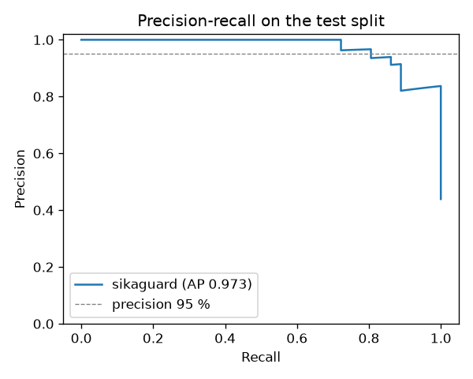

# sikaguard — evaluation report

> **Seed data warning.** This model was trained and tested on the *seed dataset*:
> SMS written by hand from publicly documented scam patterns, not real collected
> messages. These numbers validate the pipeline; they are **not** an estimate of
> real-world performance. Real-data results will replace them in v0.1.0.

Model `0.1.0.dev0` · dataset `0.1.0.dev0` · 325 train / 82 test SMS · split by near-duplicate group, stratified by category · test split opened once.

## Benchmark

Average precision (area under the precision-recall curve) with 95 % bootstrap CI.

| Model | CV AP (train) | Test AP [95 % CI] | Test F1 | Recall @ precision 95 % |
|---|---|---|---|---|
| B0 majority class | 0.431 | 0.439 [0.329, 0.549] | 0.000 | 0.0 % |
| B1 rules only | 0.885 | 0.892 [0.801, 0.971] | 0.917 | 11.1 % |
| B2 naive Bayes (words) | 0.972 | 0.982 [0.952, 0.999] | 0.864 | 88.9 % |
| B3 linear SVM | 0.985 | 0.976 [0.943, 0.996] | 0.901 | 83.3 % |
| B4 sikaguard (retained) | 0.983 | 0.973 [0.935, 0.995] | 0.901 | 80.6 % |

Regularization chosen by grouped CV: C = 10.0 (strongest regularization within 0.001 AP of the best).

## Operating point (three verdicts)

Thresholds chosen on out-of-fold train predictions: `arnaque` if score ≥ 0.421 (precision ≥ 95 %), `legitime` if score < 0.161 (recall ≥ 98 %), `suspect` in between.

| True label \ verdict | arnaque | suspect | legitime |
|---|---|---|---|
| arnaque | 32 | 1 | 3 |
| legitime | 4 | 3 | 39 |

- Precision of the `arnaque` verdict: 88.9 %
- Scams flagged `arnaque`: 88.9 %; flagged `arnaque` or `suspect`: 91.7 %
- Legitimate SMS flagged `arnaque`: 8.7 %; `arnaque` or `suspect`: 15.2 %
- **Hard legitimate SMS** (transaction notifications and OTP codes, n = 22): false-positive rate 13.6 %, flagged suspect or worse 13.6 %
- Category model on test scams (n = 36): accuracy 88.9 %, macro-F1 0.888



## Per category (test)

| Category | Label | n | Detected / flagged |
|---|---|---|---|
| autre_arnaque | arnaque | 5 | 80.0 % |
| faux_gain | arnaque | 6 | 100.0 % |
| faux_transfert | arnaque | 6 | 83.3 % |
| investissement_emploi | arnaque | 6 | 100.0 % |
| notification_transaction | legitime | 14 | 14.3 % |
| otp | legitime | 8 | 12.5 % |
| personnel | legitime | 15 | 13.3 % |
| phishing_lien | arnaque | 6 | 100.0 % |
| promo_operateur | legitime | 9 | 22.2 % |
| usurpation_operateur | arnaque | 7 | 85.7 % |

## Adversarial robustness

Share of test scams still flagged (`arnaque` or `suspect`) after each disguise. *Without normalization* is the same model trained on raw lower-cased text.

| Disguise | With normalization | Without normalization |
|---|---|---|
| original | 91.7 % | 88.9 % |
| leetspeak | 91.7 % | 77.8 % |
| homoglyphs | 91.7 % | 61.1 % |
| spaced_letters | 91.7 % | 86.1 % |
| zero_width | 91.7 % | 88.9 % |
| emojis | 91.7 % | 86.1 % |
| strip_accents | 91.7 % | 91.7 % |
| upper | 91.7 % | 88.9 % |

## Pre-registered objectives

| Objective | Target | Achieved | Met |
|---|---|---|---|
| test_average_precision | ≥ 0.95 | 0.9726 | yes |
| recall_at_precision_95 | ≥ 0.9 | 0.8056 | no |
| hard_legit_false_positive_rate | ≤ 0.05 | 0.1364 | no |
| min_detection_under_perturbation | ≥ 0.85 | 0.9167 | yes |

## Notes

- Run 2 (2026-10-01). The first run revealed a code bug: links written with Cyrillic look-alike letters escaped link detection (homoglyphs row: 80.6 %). Look-alike letters are now folded before link detection, and such links are flagged as homograph attacks. No retraining was needed (the dataset has no look-alike letters): every test-split metric is identical to run 1; only the robustness rows were re-measured.

## All test errors (11)

| Label | Category | Verdict | Score | SMS |
|---|---|---|---|---|
| arnaque | faux_transfert | legitime | 0.12 | Tonton c'est <NOM>, j'ai fait un dépôt de 15000 sur ton compte au lieu de celui de maman. Tu peux lui transférer directement au <TEL> ? |
| arnaque | usurpation_operateur | suspect | 0.20 | Cher client Moov Africa, votre ligne sera suspendue faute d'identification. Répondez avec votre numéro de pièce d'identité et votre code secret. |
| arnaque | usurpation_operateur | legitime | 0.12 | UBA: Votre compte bancaire est temporairement suspendu. Pour le réactiver, confirmez vos identifiants au <TEL>. |
| arnaque | autre_arnaque | legitime | 0.13 | Vente de moutons de Tabaski à moitié prix! Réservez en envoyant 50% par Wave, livraison la veille de la fête. |
| legitime | notification_transaction | arnaque | 0.75 | Remboursement de 2 000 F crédité sur votre compte suite à l'échec de la transaction du 28/09. |
| legitime | notification_transaction | arnaque | 0.58 | Votre compte a été crédité de 45 000 XOF. Motif: remboursement assurance santé. |
| legitime | otp | arnaque | 0.81 | Votre code MoMo pour confirmer le paiement est <CODE>. Il expire dans 3 minutes. |
| legitime | promo_operateur | suspect | 0.25 | Orange: votre facture fixe du mois de septembre est disponible. Montant: 15 400 FCFA. Payez-la avec Orange Money. |
| legitime | promo_operateur | suspect | 0.41 | Orange: découvrez nos nouveaux points de vente près de chez vous sur notre site orange[.]ci |
| legitime | personnel | suspect | 0.33 | J'ai fait le dépôt de 10 000 pour la cotisation de la tontine, vérifie |
| legitime | personnel | arnaque | 0.46 | J'ai trouvé une maison à louer à 60 000 par mois, on va visiter demain |

## Reproduce

```bash
python -m sikaguard_lab.build
python -m sikaguard_lab.train
python -m sikaguard_lab.evaluate
```
